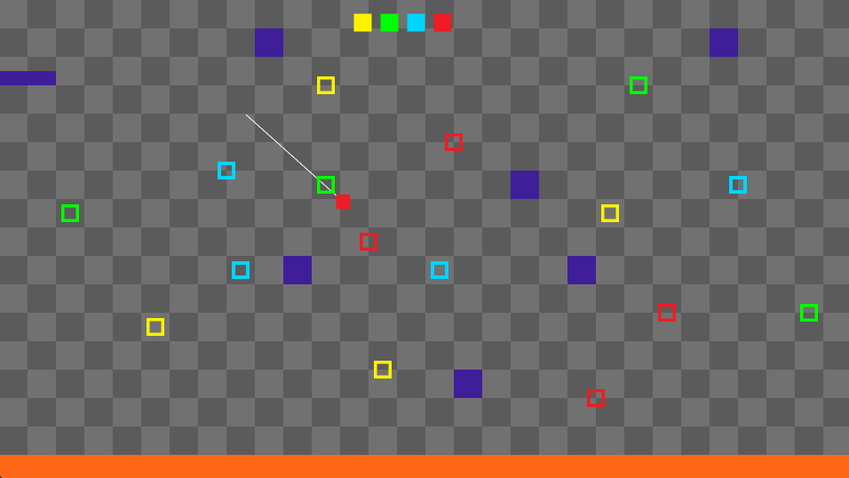

# Spinner

A physics-based memory puzzle platformer where you must navigate through dangerous chambers using your grappling hook and sharp memory.

## 🎮 How to Play

| Key | Action |
|-----|--------|
| **A / D** | Move left/right or accelerate/decelerate while swinging |
| **W** | Decrease rope length |
| **S** | Increase rope length |
| **Left Click** | Fire grappling hook |
| **Space** | Jump |

## 📖 Description

You have been trapped by a mad scientist to be experimented on. To escape the room, you must make use of your memory and proceed through the color boxes in the correct order. Fail to follow the sequence, and you'll be stuck here forever.

Also, a small warning... don't fall in the lava. I think that one is obvious.

## 🧩 Gameplay Features

- **Physics-based movement** - Swing, jump, and momentum-driven traversal
- **Memory mechanics** - Clear colored blocks in the correct sequence
- **Grappling hook** - Attach to surfaces and swing through the environment
- **Restart on failure** - Wrong color? Start over and try again

## 🛠️ Built With

- [GameMaker](https://gamemaker.io/en) - Game engine

## 🚀 Installation

1. Download the latest release from the [Releases page](https://github.com/yourusername/spinner/releases)
2. Extract the ZIP file
3. Run `Spinner.exe` 
OR
4. Try it out in my [itch.io page](https://unusualtitan711.itch.io/spinner)

## 🔧 Development Setup

1. Clone this repository
2. Open the project in GameMaker Studio 2
3. Build and run (F5)

## 🤝 Contributing

Contributions are welcome! Feel free to open issues or submit pull requests.

## 📝 License

This project is licensed under the MIT License - see the [LICENSE](LICENSE) file for details.

---

*Remember: One wrong move and you're back to the beginning. Good luck, test subject.*